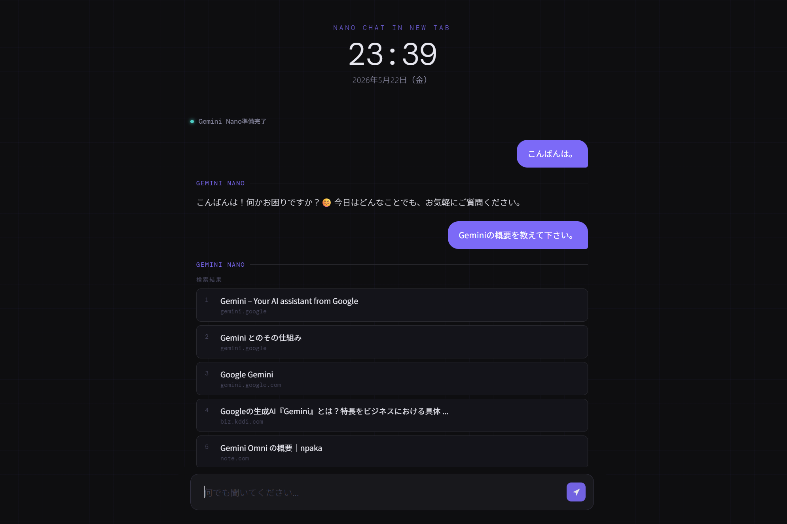
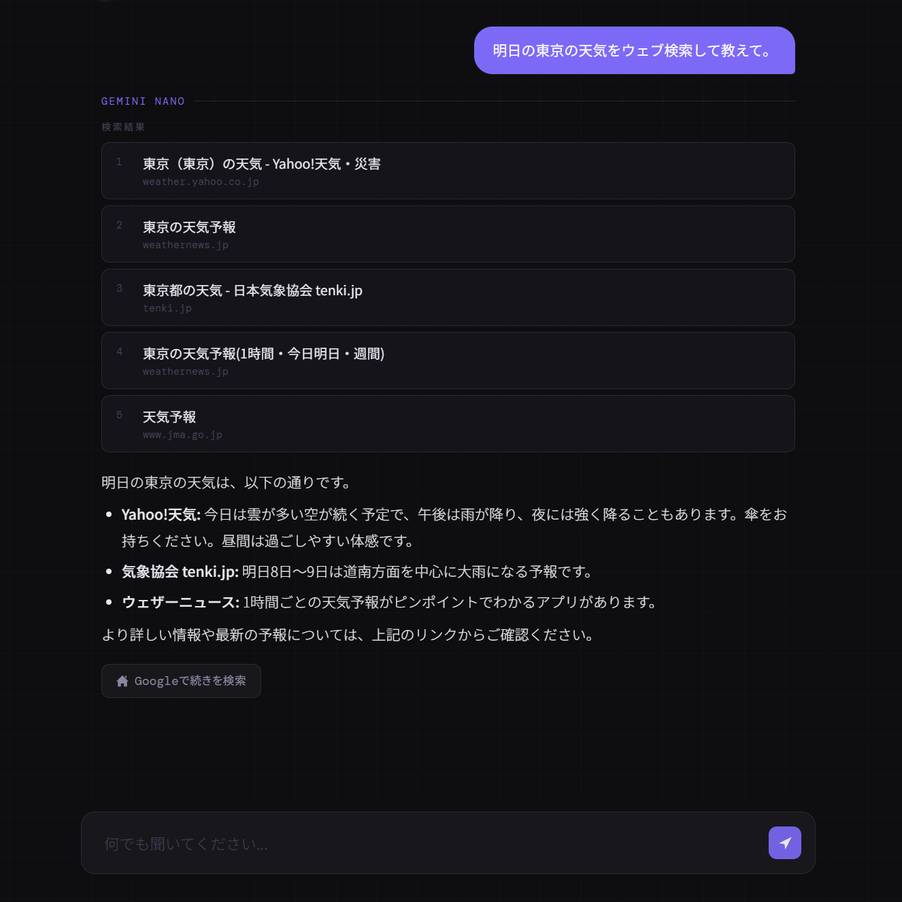

# Nano Chat in New Tab

Chromeの新しいタブページにGoogleがChromeに組み込んだオンデバイスAIである**Gemini Nano**を搭載したAIチャットインターフェイスを表示するChrome拡張機能です。





---

## 概要

新しいタブを開くと、Gemini Nanoを使ったAIチャット画面が起動します。質問の内容に応じて、Gemini Nanoが自律的にGoogle検索を行い、検索結果をもとに回答を生成します。推論処理はGemini Nanoによりデバイス上で実行されます。必要に応じてGoogle検索へアクセスし、取得した情報を回答生成に利用します。外部APIキーは不要です。

---

## 機能

- 💬 **AIチャット**：Gemini Nanoと自然な会話ができます
- 🔍 **自動Google検索**：最新情報や時事ニュースが必要と判断した場合、自動的にGoogle検索を実行して回答に反映します
- 📖 **会話履歴の保持**：直近6ターンの会話を記憶し、文脈を踏まえた回答が可能です
- 🧭 **初回オンボーディング**：初回利用時に、使い始めの短い案内を表示します
- ⚡ **ローカル処理**：Gemini Nanoはデバイス上で動作するため、APIキー不要でプライバシーにも配慮しています
- 🕐 **時計・日付表示**：新しいタブを開くたびに現在時刻と日付を表示します

---

## 仕様

| 項目 | 内容 |
|------|------|
| 対応ブラウザー | Chrome 148以降 |
| 使用モデル | Gemini Nano（Chrome内蔵） |
| 外部AI API / APIキー | 不要 |
| Google検索 | 自動判断（最新情報・時事情報が必要な場合のみ実行） |
| 会話履歴 | 直近6ターン（12メッセージ）を保持 |
| 対応言語 | 日本語中心（英語入力も処理可能） |

---

## 制限事項

- Chrome 148以降が必要です。それ以前のバージョンではGemini NanoのAPI（`LanguageModel`）が利用できません。
- Gemini Nanoのダウンロードが必要な場合があります。モデルがデバイスにない場合、ダウンロードボタンが表示されます。
- 会話履歴はタブを閉じるとリセットされます。永続的な記憶機能はありません。
- Gemini Nanoはコンパクトなモデルです。複雑な推論や長文生成は、大規模モデルと比べて精度が劣る場合があります。
- Google検索結果のパースはGoogleのUI変更により動作しなくなる可能性があります。
- 検索結果取得方法は将来変更される可能性があります。Google検索の仕様変更により一部機能が利用できなくなる場合があります。

---

## プライバシー

- 会話内容は永続保存されず初回案内の表示済みフラグのみブラウザーに保存します
- Gemini Nanoによる推論はデバイス上で実行されます
- Google検索が必要な場合のみ、検索クエリーがGoogleへ送信されます

---

## インストールと起動の方法

### 1. Gemini Nanoを有効にする

Chromeのアドレスバーに以下を入力し、それぞれ`Enabled`に設定してChromeを再起動します。

```
chrome://flags/#optimization-guide-on-device-model
→ Enabled BypassPerfRequirementに設定

chrome://flags/#prompt-api-for-gemini-nano
→ Enabledに設定
```

### 2. 拡張機能を読み込む

1. このリポジトリーをクローンまたはZIPでダウンロードして解凍します
```bash
git clone https://github.com/columuni/nano-chat-in-new-tab.git
```
2. Chromeのアドレスバーに`chrome://extensions`と入力して開きます
3. 右上の 「デベロッパーモード」をONにします
4. 「パッケージ化されていない拡張機能を読み込む」をクリックし、解凍したフォルダーを選択します

### 3. 動作確認

新しいタブを開き、チャット画面と初回案内が表示されれば完了です。Gemini Nanoのダウンロードが必要な場合は、表示されるボタンをクリックしてください。

---

## TODO

- CSSを最新のネスト仕様に書き換え
